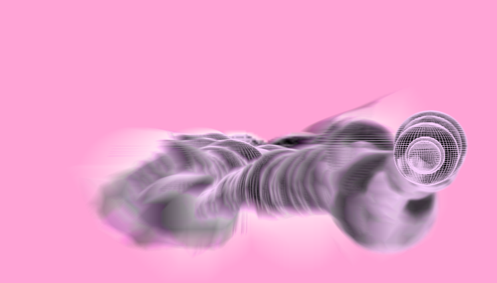
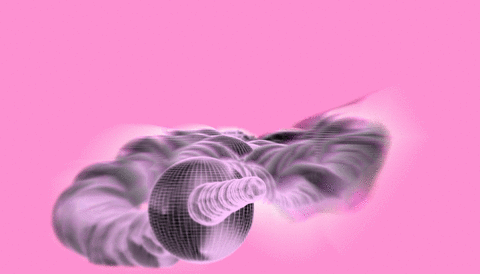
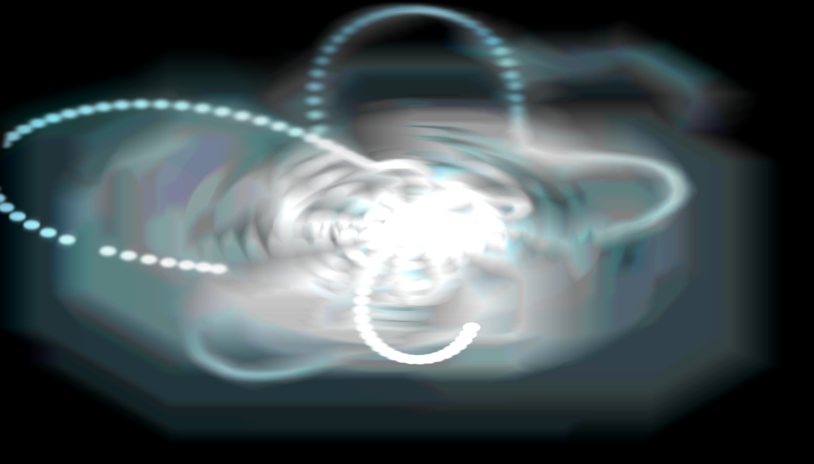
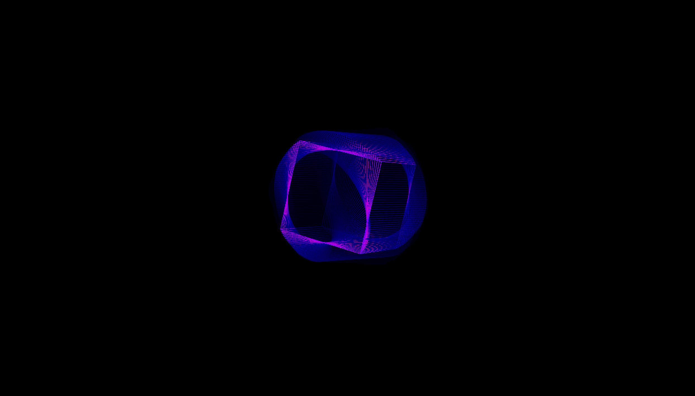
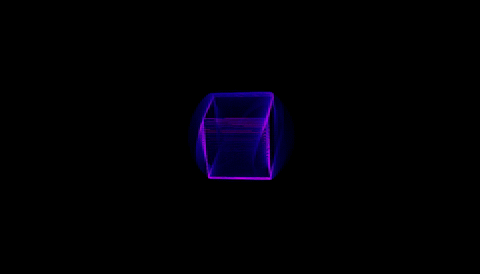
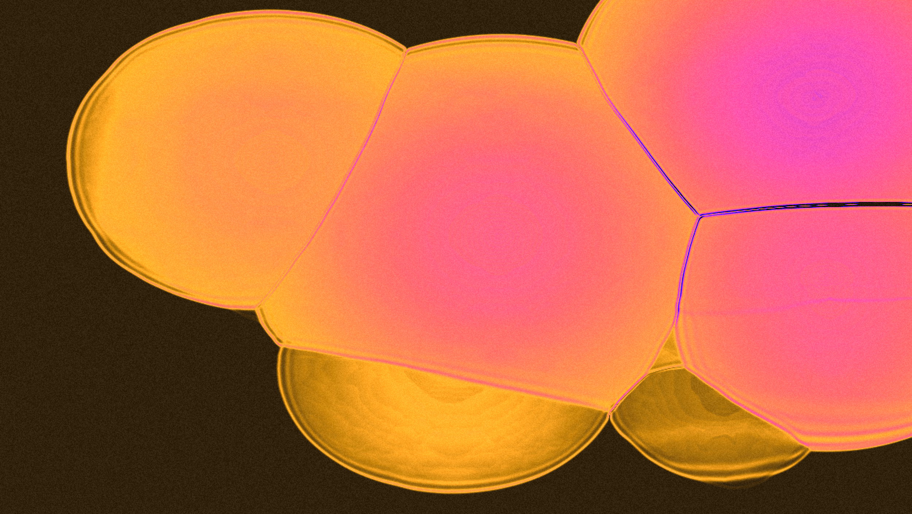

# TouchDesigner_experiments
Experiments and code from online TD tutorials

## Experiments
audio_reactive_3D

particles_swarm

polar motion feedback

rotating cube feedback

## Tutorials from [Bileam Tschepe](https://www.youtube.com/user/nose2bear)

